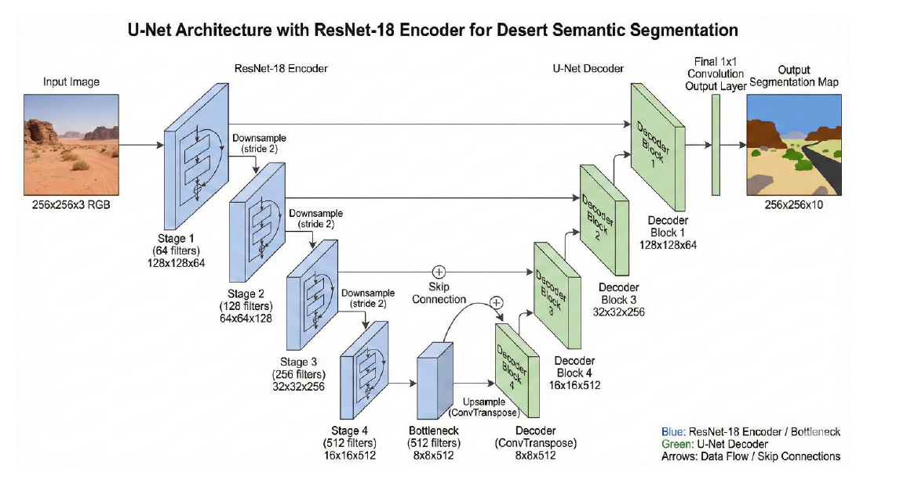

# Desert Semantic Segmentation


Robust terrain-aware semantic segmentation using synthetic digital twin data.

---

## Overview

This project implements a modular semantic segmentation pipeline designed to generalize across desert terrains using synthetic training data.

The system is built using a U-Net architecture with a ResNet-18 encoder backbone and optimized for stable domain generalization and rare-class robustness.

Final Validation mIoU (with TTA): **0.5402**

---

## Problem Statement

Desert and off-road terrains present unique challenges in computer vision:

- Sparse object boundaries
- High texture similarity between vegetation types
- Large dominant background regions
- Illumination variability

Traditional segmentation models trained on structured urban datasets often struggle in such low-structure environments.

This project investigates whether a synthetic-first training strategy can achieve robust cross-terrain generalization while maintaining strict dataset separation.

---

## Methodology

### Architecture

- Model: U-Net
- Encoder: ResNet-18 (ImageNet pretrained)
- Classes: 10
- Input Resolution: 256 × 256

### Loss Function

Hybrid loss:

- Weighted Cross Entropy
- Dice Loss

### Optimization

- Optimizer: Adam
- Learning Rate: 1e-3
- Scheduler: ReduceLROnPlateau
- Epochs: 30

### Inference Enhancement

- Test-Time Augmentation (Horizontal Flip Averaging)

---

## Model Architecture

The model uses a U-Net decoder with skip connections and a ResNet-18 encoder backbone for feature extraction.

- Downsampling encoder blocks
- Bottleneck feature representation
- Upsampling decoder with skip concatenation
- Final 1×1 convolution for 10-class prediction

## Results & Evaluation

The model was evaluated on a held-out validation set of synthetic desert terrain. The inclusion of **Test-Time Augmentation (TTA)** and a **Hybrid Loss function** were key to handling rare classes and texture similarities.

### Performance Metrics

| Metric              | Score      | Note                                       |
| :------------------ | :--------- | :----------------------------------------- |
| **Validation mIoU** | 0.5313     | Base model performance                     |
| **Final TTA mIoU**  | **0.5402** | +0.9% boost from Horizontal Flip averaging |
| **Training Status** | Converged  | Stable at 30 epochs                        |

### Class-Wise Insights

- **High Performance:** Landscape and Sky classes achieved the highest IoU due to large spatial consistency.
- **Rare Class Stability:** Hybrid Loss (Dice + Weighted CE) improved detection for underrepresented classes like Flowers and Logs.
- **Inference Robustness:** TTA effectively reduced boundary noise and edge inconsistencies.

### Visualizing Segmentation


_Current visualization shows the U-Net architecture utilized for these results._

### Observations

- Strong performance on dominant landscape classes
- Improved rare-class stability via hybrid loss
- Reduced prediction variance using TTA

---

## Installation

Clone repository:

```bash
git clone https://github.com/thekripaverse/Desert-Semantic-Segmentation.git
cd Desert-Semantic-Segmentation
```

Create virtual environment:

```bash
python -m venv venv
source venv/bin/activate   # Linux / Mac
venv\Scripts\activate      # Windows
```

Install dependencies:

```bash
pip install -r requirements.txt
```

---

## Usage

### Run Training

```bash
python -m src.desert_segmentation.train \
    --epochs 30 \
    --batch_size 8 \
    --lr 1e-3
```

---

### Run Evaluation

```bash
python -m src.desert_segmentation.test
```

## Demo UI

Run locally:

pip install streamlit
streamlit run apps/streamlit_app.py

This will:

- Load best model weights
- Apply Test-Time Augmentation
- Compute final mIoU

---

## Project Structure

```
Desert-Semantic-Segmentation/
│
├── src/desert_segmentation/
│   ├── train.py
│   ├── test.py
│   ├── models/
│   ├── losses/
│   ├── datasets/
│   └── utils/
│
├── tests/
├── docs/
├── pyproject.toml
├── setup.cfg
├── requirements.txt
└── README.md
```

---

## Testing

Run unit tests:

```bash
pytest tests/
```

---

## Compliance Statement

- Model trained exclusively on provided training dataset.
- No validation or test images were used during training.
- Strict dataset separation maintained throughout development.

---

## Market Landscape & Strategic Positioning

### Industry Context

Autonomous systems operating in off-road and desert environments face significant perception challenges due to:

- Sparse structural features
- Texture similarity between terrain elements
- Limited availability of annotated real-world datasets

Industries actively operating in such environments include:

- Autonomous mining and excavation systems
- Defense-grade unmanned ground vehicles (UGVs)
- Agricultural robotics in arid regions
- Infrastructure inspection in remote terrain
- Digital twin simulation environments

These sectors require reliable terrain segmentation models that generalize beyond structured urban datasets.

---

## Value Proposition

This project demonstrates a synthetic-first training strategy capable of achieving competitive segmentation performance (mIoU: 0.5402) without reliance on expensive real-world labeling.

Key advantages:

- Reduced data acquisition cost
- Faster iteration cycles using simulation
- Controlled environment training for rare terrain cases
- Modular architecture ready for domain adaptation

The system serves as a perception module that can integrate into:

- Robotics autonomy stacks
- Simulation-to-real transfer pipelines
- Edge deployment environments
- Remote terrain monitoring systems

---

## Scalability & Expansion Strategy

Although evaluated on desert terrain, the architecture is intentionally modular and supports expansion to:

- Forest and agricultural segmentation
- Industrial site monitoring
- Construction and mining automation
- Multi-terrain domain adaptation

Scalability mechanisms include:

- Backbone upgrades (ResNet-34, ResNet-50)
- Multi-scale training
- Domain adaptation techniques
- Semi-supervised fine-tuning on real-world samples
- Edge-device optimization via TorchScript

The model is not constrained to a single niche; it represents a reusable segmentation backbone adaptable across terrain-dependent industries.

---

## Execution Risk Mitigation

Concern: Reliance on synthetic data.

Mitigation Strategy:

- Fine-tuning on small real-world samples
- Domain randomization during simulation
- Test-Time Augmentation for robustness
- Hybrid loss optimization for boundary stability

This reduces sim-to-real transfer risk while preserving training efficiency.

---

## Success Metrics

The project evaluates success through:

- Mean Intersection over Union (mIoU)
- Rare-class boundary consistency
- Inference stability under augmentation
- Reproducibility via modular training pipeline

Future validation will include:

- Cross-domain testing
- Edge inference benchmarking
- Real-world dataset adaptation

---

## License

This project is licensed under the MIT License.
